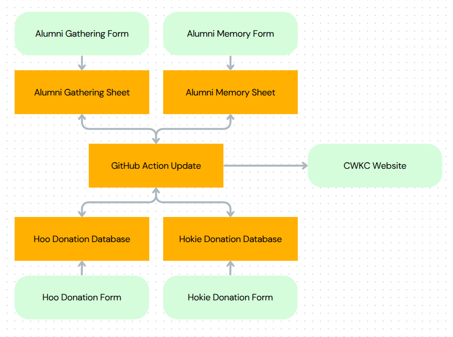
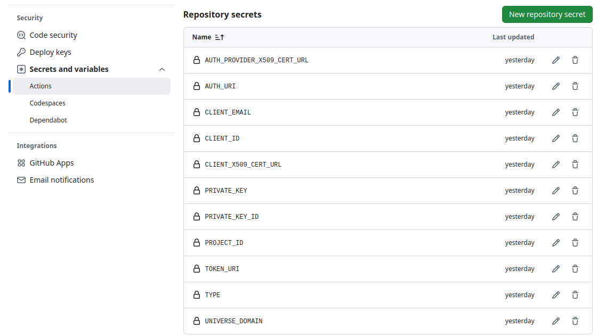

# cwkc

Commonwealth Kiddish Cup

[Hosted online here](https://msaperst.github.io/cwkc-v2/)

## Workflow

1. Forms are filled out
    1. Alumni forms
        1. Alumni forms are filled out
        2. Results populate into Google Sheets
    2. Donation forms
        1. Donation forms are filled out
        2. Email is sent out
2. GHA is triggered to scrape data into
   `results.csv` file
3. `index.html` pulls data from `results.csv` file


[Link for modifying](https://www.canva.com/design/DAGgbkbv3WQ/oSKlD4TjEMOe_xGGQLPTSQ/edit?utm_content=DAGgbkbv3WQ&utm_campaign=designshare&utm_medium=link2&utm_source=sharebutton)

## Dev

## Test

## Integration

As the workflow above shows, there are two main
integration points for our application. The first is
scraping emails from the LGL Forms to track donations,
and the second is from our alumni submitted data which
is stored in Google Sheets.

These integrations allow our hosted webpage to display
all the data in one spot, and be updated in relative
real time.

### Donations

Unfortunately, not all fields in the donations forms are
mapped to fields within LGL. This means that data can not
be extracted directly from the LGL database. Instead, we
are capturing data from the emails sent out, pulling that
data into a spreadsheet, and then analyzing it.

A script is running on a remote server that continuously
checks to see if a new email is received from LGL. If it
is, it triggers a GitHub Action to scrape the email data.
This email data is stored in a google spreadsheet, and
then an analysis of all of the data in the spreadsheet is
performed, and those numbers are saved into the csv read
by the front-end app. If needed, it can be triggered manually for more frequent
runs.

#### Setup

In order to poll for emails, simply run the
`scripts/pollEmail.py` script. In order to run, an env
file must be configured with a few values.

```env
EMAIL_ACCOUNT=servicecwkc@gmail.com
EMAIL_APP_PASSWORD=[UNIQUE_EMAIL_APP_PASSWORD]
GITHUB_TOKEN=[GHA_TOKEN]
```

This polling script can be run anywhere, so long as it
runs the entire time of the cup (so that emails can be
checked for); locally, on a small server somewhere, or
even as an ongoing GHA job.

### Gathering and Memory Forms

Each of the Alumni Gatherings and Hillel Memory forms
output their results to a Google Sheet. In order to get
these results into the site, each of the Google Sheets
that is capturing our data has a custom trigger function
written for it. When data changes, it triggers a GitHub
Action to scrape and update data. If needed, it can be
triggered manually for more frequent runs.

#### Setup

In order to tie the Google Sheets to our GitHub Actions,
a few steps need to be performed for each Google Form.

1. Create Sheets authentication following
   [these instructions](https://docs.gspread.org/en/v6.1.3/oauth2.html#for-bots-using-service-account).
   We are using a service bot for scraping this data.
   Each of the JSON components needs to be added as a
   GitHub Secret to the project
   
2. Generate a GitHub Access Token for Google Sheets to
   use to trigger updating the consolidated data. Ensure
   that scopes `repo` and `workflow` are selected
3. Inside the Google Sheet, create a new Apps Script
4. Paste the below script for the code. This will be
   used to kick off our GHA. Note that the message should
   be changed for each Sheet

```javascript
function triggerGithubAction() {
    const url = 'https://api.github.com/repos/msaperst/cwkc-v2/dispatches';
    const payload = {
        "event_type": "sheet-change",
        "client_payload": {
            "message": "A change was detected in the Alumni Gathering Google Sheet"
        }
    };
    const options = {
        'method': 'post',
        'headers': {
            'Authorization': `Bearer ${PropertiesService.getScriptProperties().getProperty('GITHUB_TOKEN')}`,
            'Content-Type': 'application/json'
        },
        'payload': JSON.stringify(payload)
    };
    UrlFetchApp.fetch(url, options);
}
```

5. Go into Apps Script Settings and add a script
   property. The property name should be `GITHUB_TOKEN`
   to match in the above script, and the value should be
   the access token value obtained in step 2. This keeps
   the access token secret/secured.
6. Go into Apps Script triggers, and create two
   triggers. One to run the script when the content
   changes, and one to run the script when the form is
   submitted.

# TODO

Open items to be addressed. These are more or less in
priority order

- Allow graceful handling of empty calculations sheet, which will zero out values
- Figure out dates in `updates.yml` and how times can work (and to make inclusive)
- Document how to add/replace forms (maybe not needed)
- Document how other schools can use this
- Replace marquee with something smarter
- Get images from gatherings and display them
- Get testimonials (both video and written) and display them
- Figure out why ifs are ignored in `update.yml`

- Identify changes in forms and update parser
    - List should send changes
- Allow multiple selections for user types
    - Will need to rework how things are calculated and recorded
- Change site design to Lyle's new one